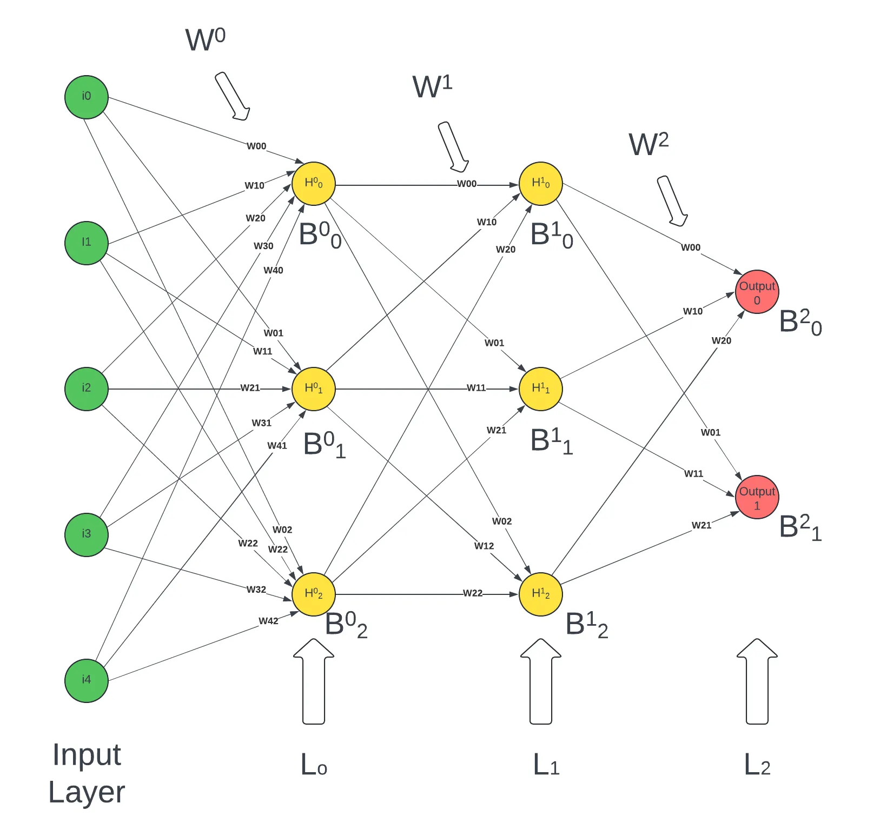

# neural-net

This repository implements a neural network using 2d arrays and math in pure java. No other frameworks and libraries used.

You've come to the right place if :
 - you're new to ML 
 - fed up with those heavily abstracted libraries like scikit learn, tensorflow, numpy (yes i'll consider numpy as abstracted!)
 - want to understand how [these](https://brilliant.org/wiki/backpropagation/) math formulas are translated to code
 - aaaand want to see it all in java (cause why not)

There are a series of medium blogs which take you through the implementation.

1. [Part 1 -> Defines the goals and the base object - Matrix](https://medium.com/thedeephub/neural-networks-implementation-from-the-ground-up-part-1-f1a392016010)
2. [Part 2 -> Explains how feedforward is implemented](https://medium.com/thedeephub/neural-networks-implementation-from-the-ground-up-part-2-feedforward-5698568ed9f8)
3. [Part 3 -> Explains backpropogation](https://medium.com/thedeephub/neural-networks-implementation-from-the-ground-up-part-3-backpropagation-e9126938edac)
4. [Part 4 -> Tests the implementation on the MNIST dataset](https://medium.com/thedeephub/neural-networks-implementation-from-the-ground-up-part-4-training-on-mnist-dataset-8d963b0c04d8)
